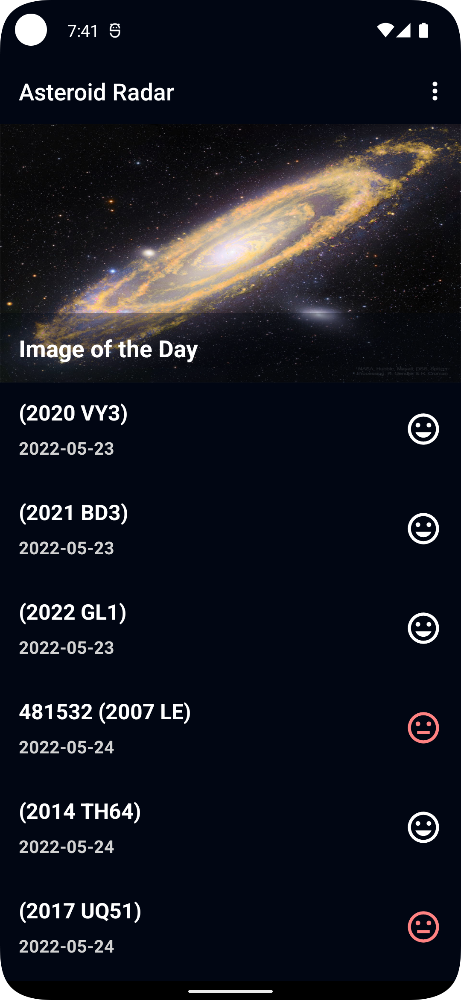

# Asteroid Radar

Asteroid Radar is an app to view the asteroids detected by NASA that pass near Earth, you can view all the detected asteroids in a period of time, their data (Size, velocity, distance to Earth) and if they are potentially hazardous.

The app is consists of two screens: A Main screen with a list of all the detected asteroids and a Details screen that is going to display the data of that asteroid once it´s selected in the Main screen list. The main screen will also show the NASA image of the day to make the app more striking.

### API Key

You need an API key from https://api.nasa.gov/.

Once the API has been generated, place them in the root local.properties file as the value for "nasa_api_key".

Example:
nasa_api_key=YOUR_API_KEY_HERE

### Screenshots

